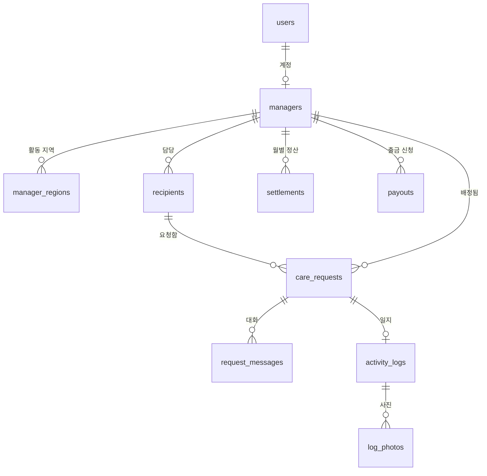

# 백엔드 소통 가이드 — DB 구조 이해하기

> 2026-08-13 · 정승환 · 프론트엔드는 아는데 백엔드를 모르는 상태에서 백엔드 담당자와 일하기 위한 문서
> 예시는 전부 **다로리 실제 데이터**로 들었습니다.

---

## 결론부터

**DB 설계는 백엔드 담당자의 일입니다. 내가 짤 필요 없습니다.**

내가 해야 하는 건 딱 두 가지입니다.

1. **"내 화면에 이런 데이터가 이런 모양으로 필요하다"를 정확히 전달하기**
2. **그 사람이 만든 구조가 내 화면 요구를 충족하는지 검증하기**

그래서 이 문서는 "DB 짜는 법"이 아니라 **"백엔드 담당자와 같은 언어로 말하는 법"** 입니다. 5장의 질문 문장들이 실질적인 산출물입니다.

---

## 1. DB는 결국 엑셀 여러 장이다

지금 다로리인 담당자가 쓰는 엑셀을 떠올리면 됩니다.

| 엑셀 | DB | 설명 |
|---|---|---|
| 통합 문서(파일 하나) | **데이터베이스** | 전체 |
| 시트 | **테이블(table)** | "매니저 시트", "일지 시트" |
| 행(가로줄) | **행(row / record)** | 매니저 한 명, 일지 한 건 |
| 열(세로 항목) | **컬럼(column / field)** | 이름, 연락처, 상태 |
| 셀 | **값** | "김철수", "active" |

**엑셀과 결정적으로 다른 점 세 가지:**

1. **열마다 타입이 정해져 있다.** 숫자 칸에 "이만원"이라고 쓸 수 없습니다. 애초에 안 들어갑니다.
2. **시트끼리 서로를 가리킬 수 있다.** 일지 시트의 한 행이 "이건 매니저 시트 3번 행 사람의 일지"라고 명시합니다. 이게 2장.
3. **여러 명이 동시에 고쳐도 안 깨진다.** 엑셀 파일을 두 명이 동시에 저장하면 하나가 날아가지만, DB는 그걸 막아줍니다.

프론트엔드 감각으로 말하면, **테이블 하나 = 타입 정의 하나**입니다.

```ts
// 이 타입이 곧 managers 테이블 한 행의 모양
type Manager = {
  id: string
  name: string
  phone: string
  homeRegion: string
  hasCar: boolean
  status: 'applied' | 'educated' | 'active' | 'inactive'
}
```

내가 `lib/types.ts` 에 쓰는 타입과 백엔드의 테이블은 **거의 1:1로 대응**합니다. 그래서 타입을 먼저 맞추면 소통의 절반이 끝납니다.

---

## 2. 왜 한 시트에 다 안 넣고 나누는가

엑셀이라면 매니저 정보를 한 시트에 다 넣고 싶어집니다. 그런데 다로리 기획서에 이런 항목이 있습니다.

> 활동 가능 지역(복수 선택), **최대 10개**

엑셀식으로 하면 이렇게 됩니다.

```
이름   | 활동지역1 | 활동지역2 | 활동지역3 | ... | 활동지역10
김철수 | 화양읍    | 청도읍    | (빈칸)    | ... | (빈칸)
```

**문제가 바로 보입니다.** 11개로 늘리면 어떡하나. 빈칸이 8개씩 낭비된다. "화양읍에서 활동 가능한 매니저"를 찾으려면 열 10개를 전부 뒤져야 한다.

그래서 **테이블을 나눕니다.**

```
managers 테이블
id  | name
m1  | 김철수
m2  | 이영희

manager_regions 테이블          ← 매니저의 활동 가능 지역
id  | manager_id | region
r1  | m1         | 화양읍
r2  | m1         | 청도읍
r3  | m2         | 운문면
```

김철수가 지역 5개를 고르면 `manager_regions` 에 5줄이 생깁니다. 몇 개든 상관없습니다.

**이걸 1:N 관계(일대다)라고 부릅니다.** 매니저 1명에 지역 여러(N) 개. 다로리에서 1:N인 곳:

| 하나 | 여럿 |
|---|---|
| 매니저 1명 | 활동 가능 지역 여러 개 |
| 매니저 1명 | 담당 대상자 여러 명 |
| 요청 1건 | 메시지 여러 개 |
| 일지 1건 | 첨부 사진 여러 장 |
| 매니저 1명 | 월별 정산 여러 건 |

**여기서 나온 두 용어:**

- **기본키(PK, Primary Key)** — 각 행의 고유 번호. 위의 `id`. React의 `key` prop과 같은 역할입니다.
- **외래키(FK, Foreign Key)** — 다른 테이블의 행을 가리키는 값. 위의 `manager_id`. "이 지역은 m1번 매니저 것"이라는 뜻입니다.

---

## 3. 다로리 테이블 설계 초안

**이건 내가 제안하는 초안입니다.** 백엔드 담당자가 다르게 만들 수 있고, 그게 정상입니다. 다만 이 초안이 있으면 **"제 화면엔 이런 데이터가 필요한데 어떻게 구성하실 건가요?"** 라고 구체적으로 물을 수 있습니다.

### 3-1. 테이블 목록

```
users             계정 (로그인 정보 + 역할)
├ id, email, password_hash, role(admin|helper|recipient), created_at

managers          매니저 프로필
├ id, user_id→users, name, phone, home_region, has_car,
  status(applied|educated|active|inactive), created_at, deleted_at

manager_regions   매니저 활동 가능 지역 (최대 10)
├ id, manager_id→managers, region

recipients        돌봄 대상자
├ id, name, type(elder|child), age, region, address_detail,
  care_needs, manager_id→managers, created_at, deleted_at
                  ※ care_needs = 돌봄 필요사항 (민감정보)

care_requests     돌봄 요청
├ id, recipient_id→recipients, manager_id→managers,
  request_type, desired_at, is_time_fixed, note,
  status(requested|proposed|confirmed|completed|cancelled),
  proposed_at, confirmed_at, created_at
                  ※ is_time_fixed = "이 시간에 꼭 가야 해요"

request_messages  요청 메시지
├ id, request_id→care_requests, sender_user_id→users, body, created_at

activity_logs     활동일지
├ id, request_id→care_requests, manager_id, recipient_id,
  activity_date, started_at, ended_at,
  activity_type, place, participant_count, content, note,
  gps_start_lat, gps_start_lng, gps_end_lat, gps_end_lng,
  gps_distance, is_manual,
  status(pending|approved|rejected), reject_reason,
  reviewed_by→users, reviewed_at, created_at

log_photos        일지 첨부 사진
├ id, log_id→activity_logs, url, created_at

settlements       월별 정산
├ id, manager_id→managers, year_month, log_count,
  unit_price, amount, status(calculated|approved),
  approved_by→users, approved_at

payouts           출금 신청
├ id, manager_id→managers, amount,
  status(requested|paid|rejected), reject_reason,
  processed_by→users, processed_at, created_at

settings          시스템 설정 (한 행만 존재)
├ id, unit_price, total_budget, monthly_budget, updated_at
```

### 3-2. 관계도



### 3-3. 🔴 여기서 가장 중요한 것 — 저장하지 않는 값

기획서 `admin-managers` 표에는 컬럼이 12개 있습니다.

```
이름·연락처 / 상태 / 거주 지역 / 활동 지역 / 자차 /
담당 대상자 수 / 이번 달 활동 / 누적 활동 /
승인 누적액 / 지급 완료액 / 잔액 / 관리
```

**이 중 뒤쪽 6개는 테이블에 저장되지 않습니다.** 다른 테이블을 세어서 그때그때 계산합니다.

| 화면에 보이는 값 | 어디서 나오나 |
|---|---|
| 담당 대상자 수 | `recipients` 에서 이 매니저 걸 센다 |
| 이번 달 활동 | `activity_logs` 에서 이번 달 승인 건을 센다 |
| 승인 누적액 | `settlements` 중 승인된 것의 합 |
| 지급 완료액 | `payouts` 중 `paid` 인 것의 합 |
| 잔액 | 승인 누적액 − (신청중 + 지급완료) |

**왜 저장하지 않나?** 저장하면 반드시 틀어지기 때문입니다. 일지 하나를 승인 취소했는데 "누적액" 컬럼을 같이 안 고치면, 그 순간부터 화면 숫자가 거짓말을 시작합니다. 그리고 아무도 모릅니다.

이걸 **파생값(derived value)** 이라고 부릅니다. 원본은 하나만 두고 나머지는 계산으로 뽑는 겁니다.

> **이게 제 `lib/calc.ts` 와 직결됩니다.** 계산식을 한 곳에 모으라고 한 이유가 이겁니다. 화면 여기저기서 계산하면 같은 "잔액"이 화면마다 다르게 나옵니다.

### 3-4. 기획서 예산 카드 4단계가 어디서 나오는지

`admin-dashboard-budget` 의 핵심 4개 숫자입니다.

| 화면 항목 | 계산 |
|---|---|
| 전체 예산 | `settings.total_budget` (유일하게 그냥 저장된 값) |
| **지급 완료액** | `payouts` 중 status='paid' 의 amount 합계 |
| **정산 필요 (승인 미지급)** | 승인된 `settlements` 합계 − (지급완료 + 신청중 출금) |
| **승인 대기 예상액** | `activity_logs` 중 status='pending' 건수 × `settings.unit_price` |

**"승인 대기 예상액"만 성격이 다릅니다.** 아직 정산 테이블에 들어가지도 않은, **일지 건수로 추정한 미래 금액**입니다. 그래서 이름이 "예상액"입니다.

이걸 백엔드 담당자에게 그대로 보여주면서 **"이 4개를 한 번에 주실 수 있나요?"** 라고 물으면 됩니다.

---

## 4. 프론트엔드가 실제로 부딪히는 백엔드 개념 6가지

### 4-1. 삭제는 진짜 삭제가 아니다 (soft delete)

기획서에 이 규칙이 있습니다.

> 비활성·삭제된 매니저도 **지급 이력이 있으면 표에 유지**(표기 구분)

매니저 행을 DB에서 진짜 지워버리면 그 사람의 정산·출금 기록이 가리킬 대상을 잃습니다. **예산 합계가 안 맞기 시작합니다.**

그래서 실무에서는 `deleted_at` 이라는 컬럼을 두고 **"지운 시각"만 기록**합니다. 데이터는 그대로 있고 목록에서만 빠집니다.

**내가 물어야 할 것:** "매니저를 삭제하면 과거 지급 이력은 어떻게 되나요? 실제로 지우시나요, 표시만 하시나요?"

### 4-2. 트랜잭션 — 돈 다룰 때 필수

출금 [지급 완료] 버튼을 누르면 서버에서 두 가지가 일어납니다.

```
① payouts 행의 상태를 'paid' 로 변경
② 매니저의 출금 가능 잔액이 그만큼 줄어듦
```

**①만 되고 서버가 죽으면?** 돈은 나갔는데 잔액은 그대로입니다. 매니저가 같은 돈을 또 신청할 수 있습니다.

**트랜잭션(transaction)** 은 "이 둘을 한 덩어리로 묶어서, 둘 다 되거나 둘 다 안 되게" 하는 장치입니다. 중간 상태가 없습니다.

**내가 물어야 할 것:** "출금 처리는 트랜잭션으로 묶여 있나요? 처리 중간에 실패하면 어떻게 되나요?"

> 제가 기획서에 넣은 **"출금 중복 처리 방지(멱등성)"** 도 같은 맥락입니다. 버튼을 두 번 눌러도 돈이 한 번만 나가야 합니다.

### 4-3. 필드가 비어 있을 수 있는가 (nullable)

**프론트엔드 화면이 깨지는 원인 1위입니다.**

```
recipient.managerId 가 없을 수 있나?  → 있습니다. 기획서에 "미배정 시 경고 배지"
activityLog.rejectReason 이 없을 수 있나? → 승인된 일지엔 없습니다
activityLog.gpsStartLat 이 없을 수 있나? → GPS 불가 시 수동 완료 경로가 있으므로 없을 수 있습니다
```

비어 있을 수 있는데 그걸 모르고 `recipient.manager.name` 을 화면에 쓰면, 미배정 대상자가 하나 뜨는 순간 화면 전체가 하얗게 됩니다.

**내가 물어야 할 것:** "이 필드 중에 비어 있을 수 있는 게 뭔가요?" — 목록을 통째로 받아두세요.

### 4-4. N+1 문제 — 목록 화면이 갑자기 느려지는 이유

`admin-managers` 표는 매니저마다 활동 수·정산액·잔액이 붙습니다. 이걸 순진하게 만들면 이렇게 됩니다.

```
① 매니저 목록 요청       → 30명
② 1번 매니저 통계 요청
③ 2번 매니저 통계 요청
   ... 30번 반복
= 총 31번 요청
```

이게 **N+1 문제**입니다(1번 + N번). 6명일 땐 멀쩡하다가 확장해서 30명 되면 눈에 띄게 느려집니다.

해결은 백엔드에서 **집계까지 포함해 한 번에 내려주는 것**입니다.

**내가 물어야 할 것:** "매니저 목록에 활동 수·정산액·잔액까지 포함해서 한 번에 주실 수 있나요? 화면이 표 하나라 따로 부르면 요청이 매니저 수만큼 늘어납니다."

### 4-5. 목록이 몇 건까지 오는가 (페이지네이션)

일지는 계속 쌓입니다. 1년이면 수천 건입니다. 한 번에 다 내려받으면 화면이 멈춥니다.

**끊어서 주는 방식이 두 가지 있습니다.**

- **offset 방식** — "21번째부터 20개" (페이지 번호 방식. 구현이 쉬움)
- **cursor 방식** — "이 항목 다음부터 20개" (무한 스크롤에 적합. 중간에 데이터가 추가돼도 안 밀림)

**내가 물어야 할 것:** "목록은 페이지네이션이 있나요? offset인가요 cursor인가요? 한 번에 최대 몇 건인가요?"

### 4-6. 인덱스 — 검색이 느릴 때 꺼낼 카드

DB에서 "화양읍 대상자 찾기"를 하면 기본적으로 **전체 행을 처음부터 훑습니다.** 책에서 단어를 찾으려고 1페이지부터 넘기는 것과 같습니다.

**인덱스(index)** 는 책 뒤의 색인입니다. 미리 만들어두면 바로 찾아갑니다.

내가 먼저 요구할 일은 거의 없지만, **특정 화면만 유독 느리면** 이렇게 말하면 됩니다.

**내가 물어야 할 것:** "일지 검토 화면에서 월·매니저로 필터링할 때 느린데, 인덱스가 걸려 있나요?"

---

## 5. 백엔드 담당자에게 보낼 질문 (그대로 복사)

기존 기획서 4-3의 질문 목록에 이번 내용을 합친 최종본입니다.

```
■ 상태 값 (제일 급함 — 이것만 정하면 저는 바로 시작합니다)
1. 일지 상태의 영문 값?   (검토대기/승인/반려 → pending/approved/rejected 로 갈까요)
2. 출금 상태의 영문 값?   (대기/지급완료/반려)
3. 정산 상태의 영문 값?   (산정/승인)
4. 매니저 비활성 상태의 영문 값?  (inactive?)
   ※ applied/educated/active 와 requested/proposed/confirmed/completed/cancelled 는
     기획서 Ver1.0에 확정돼 있습니다

■ 데이터 모양
5. 테이블·필드 이름 표기는? (snake_case / camelCase)
6. ID 타입은? (uuid / 숫자)
7. 날짜·시간 형식과 타임존은? (ISO8601 + 한국시간 고정?)
8. 금액은 정수(원)로 통일 가능한가요? 소수점이 생기면 정산이 틀어집니다
9. 읍·면은 뭘로 저장하시나요? 문자열 이름인가요 법정동 코드인가요?
   → 지도에 쓸 행정경계 파일과 매칭해야 해서 중요합니다
10. 비어 있을 수 있는(nullable) 필드 목록을 주실 수 있나요?

■ 화면 요구사항 (제 쪽 사정)
11. 매니저 목록에 활동 수·정산액·잔액까지 한 번에 주실 수 있나요?
    표 하나에 다 들어가서, 따로 부르면 요청이 매니저 수만큼 늘어납니다
12. 대시보드 예산 카드에 이 4개가 필요합니다. 한 번에 가능한가요?
    - 전체 예산
    - 지급 완료액 (= 실제 지급된 출금 합계)
    - 정산 필요 (= 승인됐지만 미지급)
    - 승인 대기 예상액 (= 검토대기 일지 건수 × 단가)
13. 목록 페이지네이션 방식과 한 번 최대 건수는?
14. 활동 사진은 어디에 저장되고 주소는 어떻게 받나요?

■ 저장 vs 계산
15. 매니저의 누적 지급액·잔액은 저장된 값인가요, 계산해서 주시는 건가요?
    (저장이라면 일지 승인 취소 시 같이 갱신되는지 확인 필요)
16. 매니저를 삭제하면 과거 지급 이력은? 실제 삭제인가요 표시만인가요?
    → 기획서 규칙: "비활성·삭제된 매니저도 지급 이력 있으면 표에 유지"

■ 서버에서 막아주셔야 할 것 (화면에서만 막으면 뚫립니다)
17. 잔액 초과 출금 신청 차단          ← 기획서 명시
18. 승인 취소 시 잔액 음수 방지       ← 기획서 명시
19. 지급 완료 건 수정 불가
20. 출금 중복 처리 방지 (버튼 두 번 눌러도 한 번만)
21. 출금 처리는 트랜잭션으로 묶여 있나요?
22. 관리자 아닌 요청 차단은 어디서 하나요?

■ 연결 방식
23. Supabase인가요, 직접 만드신 API인가요?
24. 관리자 인증 방식과 역할 판별 필드는?
25. 개발용 테스트 데이터를 주실 수 있나요? (실제 개인정보 없는 걸로)
```

---

## 6. 내가 안 해도 되는 것 / 해야 하는 것

| ❌ 내 일이 아님 | ✅ 내 일 |
|---|---|
| 테이블 설계, SQL 작성 | 내 화면에 필요한 데이터 모양 전달 |
| 인덱스 튜닝, 성능 최적화 | 어떤 화면이 느린지 알려주기 |
| 서버 배포, 백업 | 화면 상태(로딩·빈·에러) 처리 |
| 트랜잭션 구현 | 트랜잭션이 필요한 지점 짚어주기 (출금 처리) |
| 인증 서버 구현 | 로그인 안 된 상태 화면 처리 |

**한 문장으로:** 나는 **"무엇이 필요한가"** 를 말하고, 백엔드 담당자는 **"어떻게 만들 것인가"** 를 정합니다. 이 선을 지키면 서로 편합니다.

다만 **17~22번(서버 가드)** 만은 물러서지 마세요. 이건 "어떻게"가 아니라 **"반드시 있어야 한다"** 의 영역입니다. 화면에서만 막은 검증은 개발자 도구를 열 줄 아는 사람에게 그냥 뚫립니다. 돈이 나가는 기능이라 감사에서 문제가 됩니다.

---

## 부록. 용어 빠른 참조

| 용어 | 한 줄 뜻 | 다로리 예시 |
|---|---|---|
| 테이블 | 엑셀 시트 하나 | `managers` |
| 행 / 컬럼 | 가로줄 / 세로 항목 | 매니저 한 명 / `has_car` |
| 기본키(PK) | 각 행의 고유 번호 | `managers.id` |
| 외래키(FK) | 다른 테이블 행을 가리키는 값 | `activity_logs.manager_id` |
| 1:N 관계 | 하나에 여럿이 딸림 | 매니저 1명 : 활동지역 여러 개 |
| 파생값 | 저장 안 하고 계산해서 뽑는 값 | 잔액, 누적 지급액 |
| nullable | 비어 있을 수 있는 필드 | 미배정 대상자의 `manager_id` |
| soft delete | 진짜 안 지우고 표시만 | `deleted_at` |
| 트랜잭션 | 여러 작업을 한 덩어리로 | 출금 상태 변경 + 잔액 차감 |
| 멱등성 | 여러 번 실행해도 결과가 한 번과 같음 | 출금 버튼 중복 클릭 |
| 인덱스 | 검색용 색인 | 일지 월별 필터 |
| 마이그레이션 | 테이블 구조 변경 이력 | 컬럼 추가할 때 |
| ORM | 코드로 DB를 다루게 해주는 도구 | Prisma, Drizzle |
| 스키마 | 테이블 구조 전체 설계도 | 3-1의 목록 |
| RLS | DB 자체가 "이 사용자는 이 행만" 막는 기능 | 관리자만 전체 조회 |
